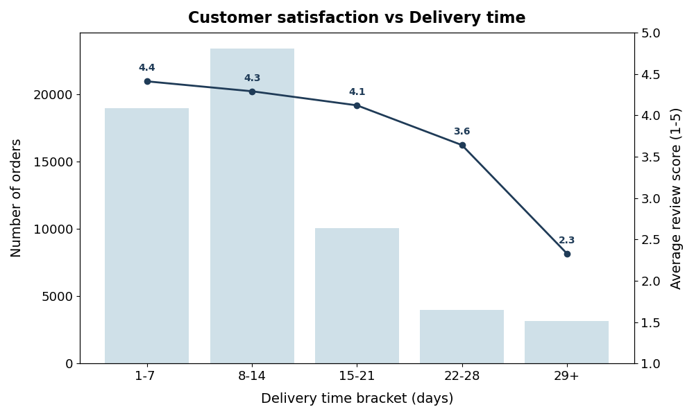
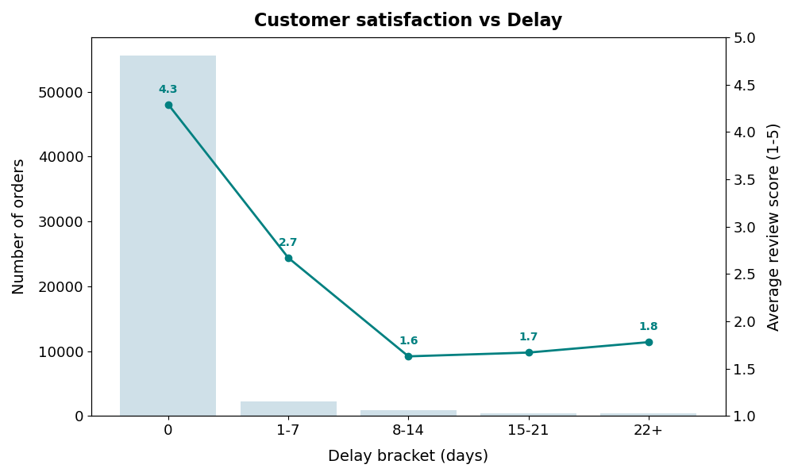
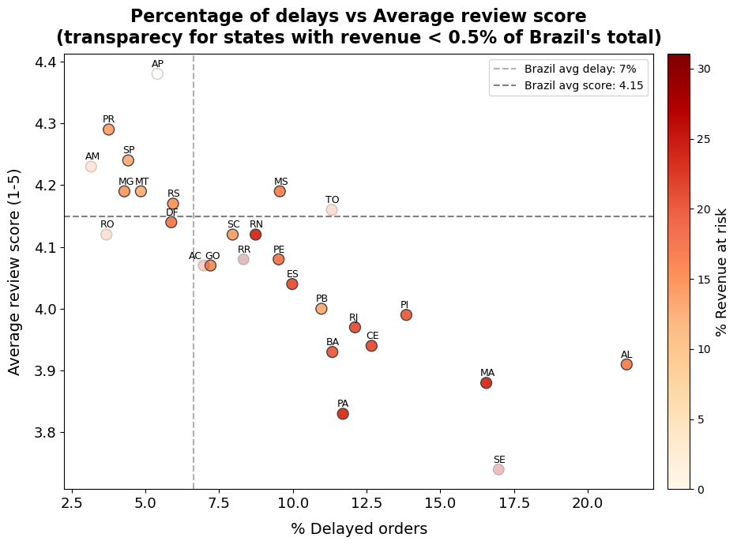
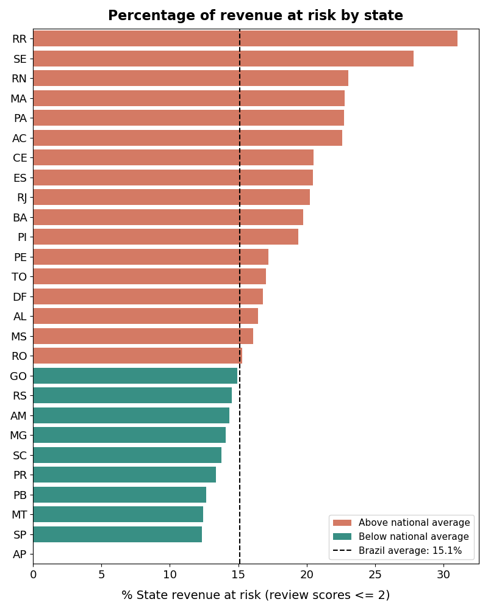

# Does Delivery Time Hurt Customer Satisfaction? — Olist E-Commerce Analysis

SQL analysis from the Brazilian e-commerce platform Olist, answering three questions:
1. Do delivery times and delays affect customer satisfaction?
2. Which geographic regions are hit hardest?
3. How much revenue is currently at risk because of it?

**Yes**, both delivery time and delay are linked to satisfaction (correlation of **-0.33** and **-0.27**, respectively).
Nationally, **15.1% of revenue (R$1.23M)** comes from orders rated ≤2 stars. The risk isn't evenly spread: **Rio de Janeiro**, Brazil's 2nd largest market by revenue, runs at **20.3%** revenue-at-risk, a third above the national average, while the largest market, São Paulo, is below it at 12.3%.

---

## 1. Dataset & Tools

- **Data:** [Olist Brazilian E-Commerce Public Dataset](https://www.kaggle.com/datasets/olistbr/brazilian-ecommerce) (orders, customers, order items, reviews), filtered to `order_status = 'delivered'`.
- **Tools:** PostgreSQL for data cleaning/aggregation, Python (pandas + matplotlib) for visualization.
- **Scope:** Orders with a valid purchase date, estimated delivery date, and actual delivered date (8 orders with missing delivery dates were excluded). Orders with multiple reviews keep only the most recent one, to avoid double-counting. Considered only the already delivered orders.

---

## 2. Does delivery time affect satisfaction?

Grouping orders by how long delivery actually took, the average review score falls from **4.41** (delivered within a week) to **2.33** (delivered in 4+ weeks).



However, it is necessary to take into account also the delay of an order. In fact, a 3+ week delivery could be fine if it was quoted upfront. This is where the effect is sharpest: orders delivered on time or early average **4.29**, but as soon as an order is delayed at all, the score collapses to **2.67**, and keeps falling toward **~1.6-1.8** for longer delays. Missing the promised date, even briefly, matters more to customers than absolute delivery speed.


The Pearson correlation tells that both Delivery time and Delay are correlated with the review score (correlation of **-0.33** and **-0.27**, respectively). Both are moderate negative correlations, though them alone don't fully determine satisfaction.

---

## 3. Where is the problem worse?

The plot of % of delayed deliveries against average review score vary a lot by state. Here, the color of each dot represents the % of revenue at risk, while the ones in trasparency are those with low revenue (less than 0.5% with respect to the total), in order to appreciate also the importance of each state.


States to the right (more delays) consistently sit lower (worse scores). **SE, MA, PA, CE** and **RJ** stand out as states combining above-average delay rates with below-average satisfaction. **RR** and **AC** show extreme delay rates too, but with fewer than 50 orders each, they have a low impact on the total Brazil's revenue.

---

## 4. How much revenue is at risk?

Nationally, **15.1%** of Olist's revenue (R$1.23M out of R$8.15M) comes from orders that received a rating of 2 stars or lower. That share varies significantly by state:



The most important business signal here isn't the states with the *highest* percentage — several of those (SE, RR, AC, RN) have too few orders to be statistically reliable. It's the states that combine **real scale** with **above-average risk**:

| State | Revenue at risk | Share of national revenue | Orders |
|---|---|---|---|
| **RJ** (Rio de Janeiro) | **20.3%** | 13.0% (2nd largest) | 7,558 |
| **BA** (Bahia) | **19.8%** | 3.8% | 2,054 |
| **ES** (Espírito Santo) | **20.4%** | 2.0% | 1,213 |

By contrast, **SP** (São Paulo) — the single largest market at 38.6% of national revenue — actually performs *better* than the national average (12.3% revenue at risk).

## 6. Repository structure

```
.
├── README.md
├── sql/
│   └── delivery_satisfaction_analysis.sql   # full cleaning + aggregation pipeline
├── data/                                     # aggregated query outputs (CSV)
│   ├── tab_delivery_bracket.csv
│   ├── tab_delay_bracket.csv
│   ├── tab_impact_revenue.csv
│   ├── tab_Brazil_benchmark.csv
│   └── tab_correlations.csv
├── images/                                   # charts embedded above
└── build_charts.py                           # reproduces all charts from the CSVs
```

*Data source: [Olist Brazilian E-Commerce Public Dataset](https://www.kaggle.com/datasets/olistbr/brazilian-ecommerce) (Kaggle, CC BY-NC-SA 4.0).*